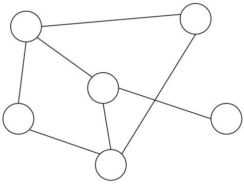
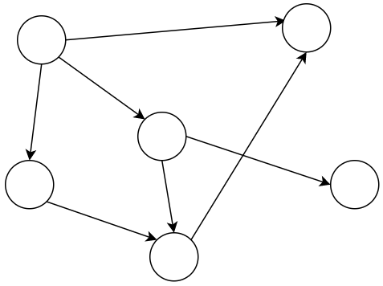
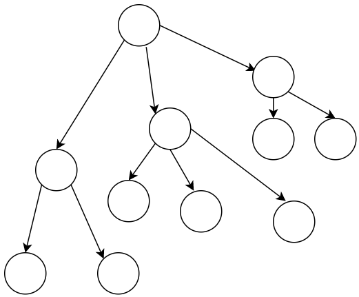
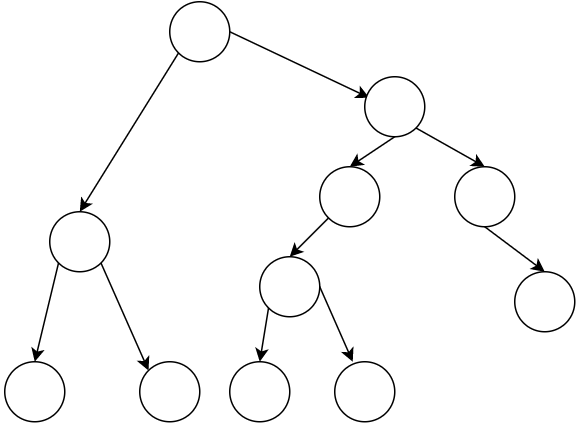
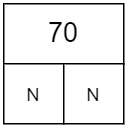
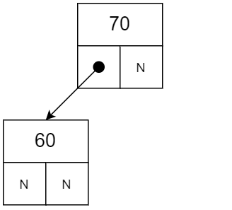
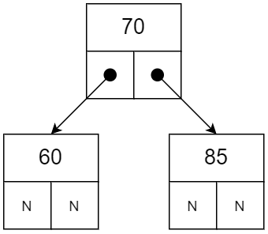
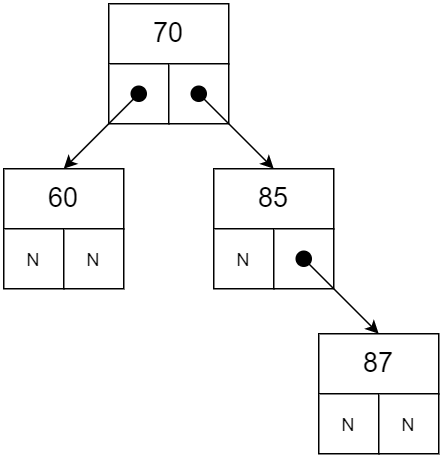
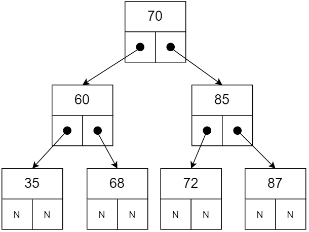
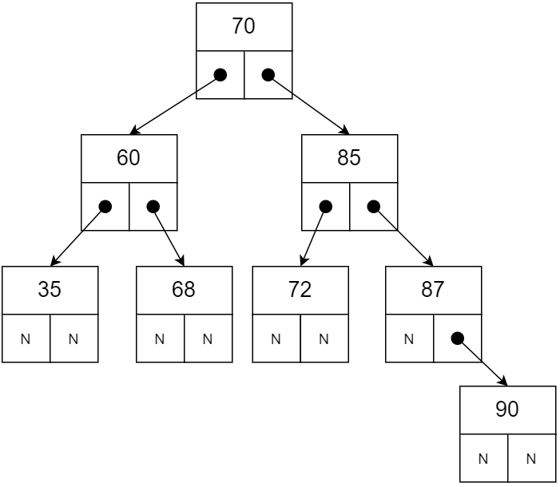

= Лабораторна робота №7
Eugeny Berkunsky <eberkunsky@gmail.com>
3.0, July 29, 2022: AsciiDoc article template
:toc:
:icons: font

*Тема:* Розробка та реалізація програм із використанням структури “Бінарне дерево”.

*Мета роботи:* отримати навички створення та реалізації програм, що використовують структуру ”Бінарне дерево”  та реалізують операції з ними.

== Завдання до лабораторної роботи

NOTE: Кожне завдання реалізувати із використанням мов програмування C/C++ та Kotlin

*Завдання 7.1.* Створити програму, що реалізує структуру ”Бінарне дерево” для зберігання та оброблення структур та файлів, які були створені в процесі виконання лабораторної роботи №5.

*Завдання 7.2.* Створити функцію для виведення інформації про елемент за вказівником на нього та виконати пункт (d) із використанням такої функції. Також створити функції додавання запису у дерево.

*Завдання 7.3* _(додаткове). Реалізувати можливість видалення вказаного елемента._

== Варіанти завдань

.  *Student*: id, Прізвище, Ім’я, По батькові, Дата народж., Адреса, Телефон, Факультет, Курс, Група
Створити бінарне дерево пошуку структур. Вивести:
..	список студентів вказаного факультету у порядку зростання дати народження;
..	список студентів, що народились після вказаного року;
..	список навчальної групи в алфавітному порядку;
..	Повну інформацію про першого знайденого студента із вказаним прізвищем.
.  *Customer*: id, Прізвище, Ім’я, По батькові, Адреса, Номер кредитної картки, Номер банківського рахунку.
Створити бінарне дерево пошуку структур. Вивести:
..	список покупців в алфавітному порядку;
..	список  покупців,  у яких номер кредитної картки знаходиться в заданому інтервалі;
..	список покупців, чия у яких номер банківського рахунку закінчується на вказану цифру;
..	повну інформацію про покупця із вказаним номером кредитної картки.
.  *Patient*: id, Прізвище, Ім’я, По батькові, Адреса, Телефон, Номер медичної картки, Діагноз.
Створити бінарне дерево пошуку структур. Вивести:
..	список пацієнтів, що мають вказаний діагноз у порядку зростання номерів медичної картки;
..	список пацієнтів чий номер медичної картки при діленні на 7 дасть вказану остачу;
..  список пацієнтів, номер медичної карти яких знаходиться в заданому інтервалі;
.. повну інформацію про пацієнта із вказаним прізвищем та номером телефона.
.   *Abiturient*: id, Прізвище, Ім’я, По батькові, Адреса, Телефон, Оцінки.
Створити бінарне дерево пошуку структур. Вивести:
..	список абітурієнтів, що мають незадовільні оцінки в алфавітному порядку;
..	список абітурієнтів, у яких сума балів вище заданої;
..	вибрати вказану кількість n абітурієнтів, що мають найбільшу суму балів;
..	повну інформацію про абітурієнта за вказаними Прізвищем, ім’ям та по батькові.
.  *Book*: id, Назва, Автор (и), Видавництво, Рік видання, Кількість сторінок, Ціна, Тип палітурки.
Створити бінарне дерево пошуку структур. Вивести:
..  список книг заданого автора у порядку спадання року видання;
..	список книг, що видані вказаним видавництвом;
..	список книг, що видані після заданого року;
..	повну інформацію про книгу із вказаним id.
.  *House*: id,  Номер  квартири,  Площа,  Поверх,  Кількість  кімнат,  Вулиця, Тип будівлі, Термін експлуатації.
Створити бінарне дерево пошуку структур. Вивести:
..	список квартир, які мають задану кількість кімнат у порядку зростання терміну експлуатації;
..	список  квартир,  що мають вказану кількість кімнат  і  розташованих між вказаними поверхами;
..	список квартир, які мають площу, що більше заданої;
..	повну інформацію про квартиру із вказаним id.
.  *Phone*: id,  Прізвище, Ім’я, По батькові, Адреса, Номер кредитної картки, Дебет, Кредит, Час міських та міжнародних розмов.
Створити бінарне дерево пошуку структур. Вивести:
..	відомості про абонентів, у яких час міських розмов перевищує вказаний у порядку алфавіту;
..	відомості про абонентів, які користувались міжміським зв’язком;
..	відомості про абонентів в алфавітному порядку;
..	повну інформацію про абонента із вказаним номером кредитної картки
.  *Car*: id, Марка, Модель, Рік випуску, Колір, Ціна, Реєстраційний номер.
Створити бінарне дерево пошуку структур. Вивести:
..	список автомобілів заданої марки, впорядкований за зростанням реєстраційного номера;
..	список автомобілів заданої моделі, які експлуатуються більше n років;
..	список автомобілів вказаного року випуску, ціна яких більше вказаної;
..	повну інформацію про автомобіль із вказаним реєстраційним номером.
.  *Product*: id,  Найменування, Тип,  Виробник,  Ціна,  Термін зберігання, Кількість.
Створити бінарне дерево пошуку структур. Вивести:
..	список товарів заданого найменування, впорядкований за зростанням ціни;
..	список товарів заданого найменування, ціна яких не більше заданої;
..	список товарів, термін зберігання яких більше заданого;
..	повну інформацію про товар із вказаним id.
. *Train*: id, Пункт призначення, Номер поїзда, Час відправлення, Число місць (загальних, плацкарт, купе, люкс).
Створити бінарне дерево пошуку структур. Вивести:
..	список поїздів, які прямують до заданого пункту призначення, впорядкований за часом відправлення;
..	список поїздів, які прямують до заданого пункту призначення та відправляються після вказаної години;
..	список  поїздів,  які відправляються  до  заданого  пункту  призначення та мають загальні місця;
..	повну інформацію про поїзд за його номером.

== Двійкові дерева

=== Графи і дерева
Спочатку надамо декілька визначень:

NOTE: Граф – це непорожня множина точок (вершин) і множина відрізків (ребер),
кінці яких належать заданій множині точок

.Неорієнтований граф

Якщо на кожному ребрі графа задати напрямок, то він буде орієнтований.

.Орієнтований граф

NOTE: Якщо, рухаючись по ребрах графа в заданому напрямку, можна потрапити із заданої вершини 1 у задану вершину 2, то говорять, що ці вершини з'єднані шляхом.

NOTE: Замкнутий шлях, що складається з різних ребер, називають циклом.

NOTE: Граф називають зв'язним, якщо будь-які дві його вершини з'єднані
шляхом. Зв'язний граф без циклів називають деревом. З кожною вершиною дерева зв'язується скінчена кількість окремих дерев, які називають піддеревами.

Схематично дерево можна зобразити таким чином:

.n-арне дерево

Для подальшої роботи з деревами необхідно засвоїти ряд понять.

NOTE: Вершину y, що знаходиться безпосередньо нижче, ніж вершина х, називають
безпосереднім нащадком х, а вершину х – предком у.

NOTE: Якщо вершина не має нащадків, то її називають термінальною вершиною або
листом, якщо має – внутрішньою вершиною.

NOTE: Кількість безпосередніх нащадків внутрішньої вершини називають її
ступенем.

NOTE: Ступенем дерева називають максимальний ступінь всіх вершин.

NOTE: Двійкове дерево – це такий спосіб подання інформації, за якого однаково
ефективно реалізуються всі три основні операції в динамічних структурах:
пошуку, запису й видалення інформації. Ця ефективність близька до ефективності
дихотомічного пошуку.

Двійкове дерево схематично можна зобразити в такий спосіб: є набір вершин,
з'єднаних стрілками, з кожної вершини виходить не більше ніж дві
стрілки (гілки), спрямовані вліво донизу і/або вправо донизу. Повинна існувати
єдина вершина, у яку не входить жодна стрілка – цю вершину називають коренем
дерева.

.Бінарне (або двійкове) дерево

Будемо вважати, що дані зберігаються у інформаційному полі структури:

[source, c++]
----
// С++
struct Node
{
    typeelem data;  // інформаційне поле
    Node * left;    // посилання на ліву гілку
    Node * right;   // посилання на праву гілку
};
----

[source, kotlin]
----
// Kotlin
data class Node<T : Comparable<T>?> (
    var data: T, var left: Node<T>? = null, var right: Node<T>? = null
)
----

_**Примітка:** `<T : Comparable<T>>` означає, що у вершині дерева зберігається значення деякого типу T, що підтримує операцію порівняння (за необхідності треба її описати)_

Приклад опису класу, що підтримує операцію порівняння `compareTo`
[source, kotlin]
----
data class Student(val id:Int, var name:String, var rating:Double) : Comparable<Student> {
    override fun compareTo(other: Student): Int {
        return if (name == other.name) {
            id - other.id
        } else name.compareTo(other.name)
    }
}
----

=== Ініціалізація двійкового дерева. Додавання елементів

Функція ініціалізації бінарного дерева нічим не відрізняється від відповідних
процедур для списків: покажчику на корінь дерева передається значення nullptr (null).

[source, c++]
----
// С++
node * root = nullptr;
----

[source, Kotlin]
----
// Kotlin
class Tree<T : Comparable<T>?> {
    var root: Node<T>? = null
    // ...
}
----

Додавання елемента у бінарне дерево можна представити у вигляді функції `addElement`.

Операцію додавання нової вершини у двійкове дерево можна розділити на кілька
кроків:

- формування нової вершини;
- пошук вершини, після якої необхідно вставити нову вершину;
- безпосередньо додавання нової вершини в дерево, тобто корегування посилань елементів.

Функція пошуку вершини, після якої необхідно вставити нову вершину, полягає в
знаходженні вершини, до якої можна приєднати («підвісити») нову вершину. У
випадку надходження запису з новим ключем треба порівняти значення цього
ключа із ключами вже наявних вершин. Якщо значення ключа нового елемента
менше, ніж значення ключа даного елемента, переходимо на ліву гілку, якщо
значення ключа нового елемента більше, ніж значення ключа даного елемента, переходимо на праву гілку. Переміщаючись у такий спосіб по дереву, знаходимо
«порожню» вершину, тобто вершину без піддерев, і залежно від результату
порівняння ключа в цій вершині із ключем, що надійшов, робимо нову
сформовану вершину лівою або правою гілкою дерева.

Наприклад, у нас є послідовність елементів із ключами: 70, 60, 85, 87, 35, 68,
72.

Перший із записів, що надійшли, із ключем 70 робимо коренем дерева.

.Додавання першого елемента у дерево

Посилання на нижні вершини дорівнюють null.

Наступний ключ 60 менший за 70, виходить, що наступна вершина – ліва для кореня.

.Додавання другого елемента у дерево

Далі 85 – права вершина для кореня.

.Додавання третього елемента у дерево

87 більше ніж 70 та 85.
87 – права вершина для вершини 85.

.Четверта вершина

Порівнюючи в такий спосіб нові вершини дерева із уже існуючими, одержуємо дерево

.Остаточне дерево

[source, c++]
----
// С++
bool addElement(int value, node **pNode) {
    if (*pNode == nullptr) {
        node *t = new node;
        t->key = value;
        t->left = nullptr;
        t->right = nullptr;
        *pNode = t;
        return true;
    } else {
        int key = (*pNode)->key;
        if (key == value) return false;
        if (key > value) {
            return addElement(value, &((*pNode)->left));
        } else {
            return addElement(value, &((*pNode)->right));
        }
    }
}
----

[source, Kotlin]
----
// Kotlin
class Tree<T : Comparable<T>?> {

    var root: Node<T>? = null

    fun addElement(value: T): Boolean {
        if (root == null) {
            root = Node(value)
            return true
        }
        return addInSubTree(value, root)
    }

    private fun addInSubTree(value: T, root: Node<T>?): Boolean {
        if (value == root!!.key) {
            return false
        }
        return if (value!! < root.key) {
            if (root.left == null) {
                root.left = Node(value)
                true
            } else {
                addInSubTree(value, root.left)
            }
        } else {
            if (root.right == null) {
                root.right = Node(value)
                true
            } else {
                addInSubTree(value, root.right)
            }
        }
    }
   // ...
}
----

=== Пошук елемента у двійковому дереві

Функція пошуку елемента у двійковому дереві полягає в знаходженні того
елемента дерева, значення ключа якого збігається із заданим значенням. Якщо
такий елемент знайдено, то функція повертає посилання на нього, інакше – null (nullptr).

Безпосередньо сам алгоритм пошуку елемента можна описати так:

- значення ключа поточної ланки дерева порівнюють із заданим значенням;
якщо значення рівні, алгоритм завершується і функція повертає посилання
на поточний елемент;
- залежно від порівняння заданого ключа й ключа поточного елемента,
переходимо на ліву/праву гілки (якщо вони існують) і продовжуємо пошук.

[source, c++]
----
// C++
node *findElement(int key, node *pNode) {
    if (pNode == nullptr) {
        return nullptr;
    }
    if (pNode->key == key) {
        return pNode;
    }
    return findElement(key, (pNode->key > key)
               ? pNode->left
               : pNode->right);
}
----

[source, Kotlin]
----
// Kotlin
class Tree<T : Comparable<T>?> {
    var root: Node<T>? = null
    // ....

    fun find(key: T): Node<T>? {
        return if (root == null) {
            null
        } else findInSubTree(key, root)
    }

    private fun findInSubTree(key: T, root: Node<T>?): Node<T>? {
        if (root == null || key == root.key) {
            return root
        }
        return if (key!! < root.key) {
            findInSubTree(key, root.left)
        } else {
            findInSubTree(key, root.right)
        }
    }
    // ....
}
----

=== Обхід та виведення двійкового дерева

Функція обходу (виведення) двійкового дерева на екран, на перший погляд, трохи
складна, оскільки елементи розташовуються у нелінійній структурі, для цього
необхідно виконати повний обхід дерева.

Для виведення такого роду структур найкраще застосовувати рекурсивний виклик функції виведення одного елемента двійкового дерева, виконуючи для кожної вершини три дії:

- вивід даних, що зберігаються у вузлі;
- обхід лівого піддерева;
- обхід правого піддерева.

Порядок виконання названих дій визначає спосіб обходу дерева. Способи виведення:

- зверху донизу;
- зліва направо;
- знизу нагору.

Функція виводу дерева зліва направо має такий вигляд:

- необхідно спочатку вивести всю ліву гілку дерева,
- потім значення самого кореня дерева,
- а потім всю праву гілку дерева.

Дану функцію необхідно повторити для кожного елемента будь-якої гілки. Таким чином, загальний алгоритм виведення двійкового дерева можна описати в такий спосіб:

. виведення лівої гілки елемента, якщо вона є;
. виведення елемента;
. виведення правої гілки, якщо вона є.

Нижче наведено тексти рекурсивних функцій, що реалізують дану операцію.

[source, c++]
----
// C++
void traverseTree(node *pNode) {
    if (pNode != nullptr) {
        traverseTree(pNode->left);
        cout << pNode->key << " ";
        traverseTree(pNode->right);
    }
}
----

[source, Kotlin]
----
// Kotlin

class Tree<T : Comparable<T>?> {
    var root: Node<T>? = null
    // ....

    fun traverse() {
        traverse(root)
    }

    private fun traverse(root: Node<T>?) {
        if (root != null) {
            traverse(root.left)
            visit(root)
            traverse(root.right)
        }
    }

    private fun visit(node: Node<T>) {
        println(node.key)
    }
    // ....
}
----

=== Видалення вузла з двійкового дерева

Безпосереднє видалення запису (вузла) реалізується дуже просто, якщо ця
вершина є кінцевою, або з неї виходить тільки одне піддерево, достатньо тільки
скорегувати відповідне посилання вершини попередника.

Основні труднощі пов'язані з видаленням вершини, з якої виходять два піддерева. У цьому випадку
потрібно знайти відповідну вершину дерева, яку можна було б вставити на місце тієї,
що видаляється, причому ця відповідна вершина повинна просто переміщатися.

Така вершина – це або крайній правий елемент лівого піддерева (для досягнення цієї
вершини необхідно перейти в наступну вершину по лівій гілці (лівому піддереву), а потім переходити
в інші вершини тільки по правій гілці (правому піддереву) доти, поки чергове таке посилання не буде дорівнювати null), або крайній лівий елемент правого піддерева (для досягнення
цієї вершини необхідно перейти в наступну вершину по правій гілці (правому піддереву), а потім
переходити в ліві вершини доти, поки чергове таке посилання не буде дорівнювати null).

Очевидно, що знайдені таким чином вершини можуть мати не більше одного піддерева.

<<<

Отже, функція видалення із двійкового дерева вершини із заданим ключем повинна розрізняти три випадки:

. вершини із заданим ключем у дереві немає;
. вершина із заданим ключем має не більше ніж одне піддерево;
. вершина із заданим ключем має два піддерева.

Наприклад, розглянемо дерево:

.Дерево перед видаленням елемента

- Якщо потрібно видалити вершину зі значенням 75, то очевидно, маємо випадок (1) - нічого робити не треба

- Якщо потрібно видалити один з елементів 35, 68, 72 або 90 - ці вершини не мають піддерев, тобто маємо випадок (2) і їх можна просто видалити

- Якщо потрібно видалити елемент 87 - також маємо випадок (2), оскільки ця вершина має одне піддерево, та її можна видалити, замінивши на першу вершину із єдиного піддерева

- Вершини з елементами 60, 85 та 70 мають по два піддерева, отже маємо випадок (3).

[source, c++]
----
// C++
// допоміжна функція пошуку крайнього правого елемента у лівому піддереві
void removeEl(node **pNode, node **q) {
    if ((*pNode)->right != nullptr) removeEl(&(*pNode)->right, q);
    else {
        (*q)->key = (*pNode)->key;
        *q = *pNode;
        *pNode = (*pNode)->left;
    }
}

// основна функція видалення елемента
void removeElement(int value, node **pNode) {
    if (*pNode == nullptr); else {
        if (value < (*pNode)->key)
            removeElement(value, &((*pNode)->left));
        else {
            if (value > (*pNode)->key)
                removeElement(value, &((*pNode)->right));
            else {
                node *q = *pNode;
                if (q->right == nullptr) *pNode = q->left;
                else if (q->left == nullptr) *pNode = q->right; else {
                    removeEl(&(q->left), &q);
                }
                delete q;
            }
        }
    }
}
----

[source, Kotlin]
----
class Tree<T : Comparable<T>?> {
    var root: Node<T>? = null
    // ....

    fun removeElement(key: T) {
        removeElement(key, root)
    }

    private fun removeElement(key: T, node: Node<T>?) : Node<T>? {
        var root = node
        if (root == null) return root
        if (key!! > root.key) {
            root.right = removeElement(key, root.right)
        } else if (key < root.key) {
            root.left = removeElement(key, root.left)
        } else {
            if (root.left == null && root.right == null) {
                root = null
            } else if (root.right != null) {
                root.key = successor(root)
                root.right = removeElement(root.key, root.right)
            } else {
                root.key = predecessor(root)
                root.left = removeElement(root.key, root.left)
            }
        }
        return root
    }

    /*
       Пошук безпосередньо наступного значення
       Крайній лівий елемент у правому піддереві
    */
    private fun successor(node: Node<T>) : T {
        var root = node
        root = root.right!!
        while (root.left != null) {
            root = root.left!!
        }
        return root.key
    }

    /*
       Пошук безпосередньо попереднього значення
       Крайній правий елемент у лівому піддереві
    */
    private fun predecessor(node: Node<T>) : T {
        var root = node
        root = root.left!!
        while (root.right != null) {
            root = root.right!!
        }
        return root.key
    }
    // ....
}
----

NOTE: Зверніть увагу, що код мовою Kotlin дещо складніший, через відсутність механізмів роботи з покажчиками, і хоча в більшості випадків, покажчики легко замінюються на безпечні посилання, деякі складнощі все одно залишаються. Наприклад, неможливо отримати покажчик на покажчик і через те, доводиться писати більш складний код. Але це компенсується тим, що в Kotlin (як і в Java) є автоматичне "прибирання сміття" - вивільнення пам'яті, яку займали видалені об'єкти.

